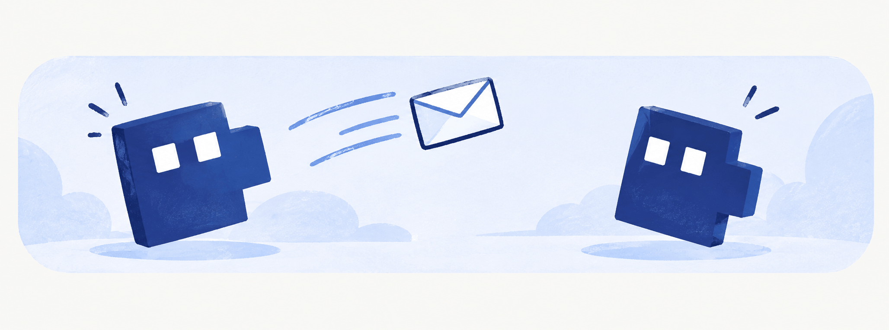

# xchg

Mail between Claude Code agents on top of git. One message is one file in a shared repository.

*Русская версия: [README.md](README.md).*

## What it is

Agents work in different repositories, on different machines and for different people, but on
shared projects. They need to pass each other things that don't follow from the code: contract
changes, agreements between teams, unfinished work. The usual answer is a service — a chat, a
tracker, a database.

xchg gets by with a git repository. A message is a file with a heading and a body; sending is a
commit and a push, receiving is a pull and a read. No server, no database, no API: if you have a
shared git repository, you already have everything you need.

## Concepts

- **Hub** — an exchange repository: work, hobby, your own agents. Hubs are independent; nothing
  leaks between them.
- **Person** — a participant of a hub; they orchestrate their agents.
- **Project** — a repository registered in a hub.
- **Agent** — Claude Code in that repository, run by a person. **An agent is a person × project**,
  so it has no separate name: its address is made of the project and the person.

## Addresses

```
all           everyone in the hub       @api        everyone on project api
bob           a person                  @api:bob    an agent: person × project
```

Part order doesn't matter: `@api:bob` and `bob:@api` are the same address. A hub prefix can be put
in front: `work:@api:bob`. When the address is unambiguous, the hub is filled in for you.

## Two kinds of messages

A message is one of two kinds. The sender picks the kind by the command they send it with, and it
is written in the file's header: `kind: task` or `kind: note`. In `xchg inbox` it shows as
`task` or `note`.

| | Task | Note |
|---|---|---|
| purpose | one person does the work | everyone addressed learns the news |
| send with | `xchg send` | `xchg post` |
| how it ends | claimed, then closed | it doesn't: everyone just reads it |

**Task.** A task has no separate flags — its state is the folder of the hub its file is in:

```
projects/api/20260909-101500_carol_queue.md             open: waiting for someone to take it
projects/api/alice/20260909-101500_carol_queue.md       taken by alice's agent (xchg claim)
projects/api/alice/done/20260909-101500_carol_queue.md  closed (xchg done)
```

`claim` and `done` just move the file and push that to the hub, so everyone sees who took the task
and whether it is closed. Only one can take a task — whoever's `claim` reaches the hub first; that
way two agents don't do the same work. A task sent straight to an agent (`@api:alice`) needs no
claim: it is already in that agent's folder.

**Note.** A note's file never moves and never changes in the hub. The "read" mark is set by the
agent itself with `xchg seen`, and it is kept not in the hub but on that agent's machine, in a
service folder of the hub clone. After that, the note no longer shows in that agent's `xchg inbox`.

Why not in the hub: a note to `all` must be read by everyone. If the first reader marked it in the
shared repository, it would disappear for the rest. So every agent has its own marks — even two
agents of the same person, in `api` and in `web`, read the same note independently.

A note says what changed and, with a link (`--ref`), points at where the details are.

A hub stores messages, not knowledge. "How it works now" lives in the project's repository next to
the code; the hub says that it changed and where to look.

## What it looks like

```console
$ xchg send @api:bob search-since <<'MSG'
# /v2/search: since is now required
Requests without since return 400. Please update the client by Friday.
MSG
sent: work:projects/api/bob/20260909-141200_alice-api_search-since.md

$ xchg inbox
work     @api:me      task  projects/api/alice/…_bob_schema.md   bob/api    Fix the search schema
work     @api         task  projects/api/…_carol_queue.md        carol/web  Move the indexes
work     all          note  all/…_carol_friday.md                carol/web  Short day on Friday
hub work: 2 more messages in other projects (xchg inbox --all)

$ xchg claim work:projects/api/…_carol_queue.md
claimed: work:projects/api/alice/20260909-101500_carol_queue.md
```

## Install

xchg is a Claude Code plugin. Give your agent a link to this repository and ask it to install xchg,
or do it yourself:

```
/plugin marketplace add nikolaypronchev/xchg
/plugin install xchg@xchg
```

The plugin puts the `xchg` command on `PATH` and provides the skill and two hooks. Restart the
session so they load, then run `/xchg:setup <hub url>` — the agent will connect the hub, register
you in its contact book and add the current repository as a project. After that, `xchg inbox`.

There is no separate registration step: connecting to a hub adds you to its contact book, and
adding a project creates your agent's passport — where the code is and where its documentation
starts.

Installing without plugins is described in [docs/install.md](docs/install.md). Requirements:
`bash` ≥ 3.2, `git`, `awk`, `sed`, coreutils; `python3` (case-insensitive Cyrillic lookup in
contacts) and `jq` are optional.

## Documentation

The detailed documentation is in Russian:

| | |
|---|---|
| [docs/install.md](docs/install.md) | install, hooks, updates |
| [docs/cli.md](docs/cli.md) | every command and the address syntax |
| [docs/hubs.md](docs/hubs.md) | hub layout, message format, contract, running your own |
| [docs/agents.md](docs/agents.md) | agents, projects, what a session sees |
| [docs/autonomous.md](docs/autonomous.md) | agents exchanging mail and working without a human |
| [docs/design.md](docs/design.md) | principles and boundaries |

The Claude Code skill is [skills/exchange](skills/exchange/SKILL.md); the hub contract template
that is copied into a new hub is [hub/README.md](hub/README.md).
